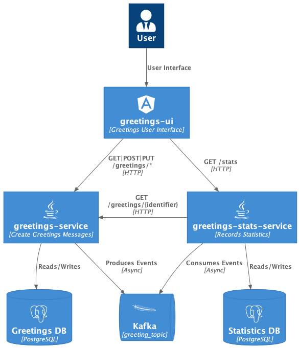

= Demonstration Project

== Architecture overview

.architecture overview

== List of patterns / concepts /technics demonstrated

* Hexagonal Architecture
* Multimodules Spring Boot Project
* REST API with Spring MVC (link:./greetings-service[greeting service]) and Spring Web Reactive (link:./greetings-stat-service[stat service])
* Kafka Consumer (link:./greetings-stat-service[stat service]) / producer (link:./greetings-service[greeting service])
* Reactive implementation (link:./greetings-stat-service[stat service])
* Test : Unit tests with Mockito and AssertJ
* Test : Integration tests with Spring Slice Tests Annotations
* Test : Integration tests with `@EmbeddedKafka`
* Test : BDD test with Cucumber with JUnit 4 (link:./greetings-service[greeting service]) or JUnit 5 (link:./greetings-stat-service[stat service])