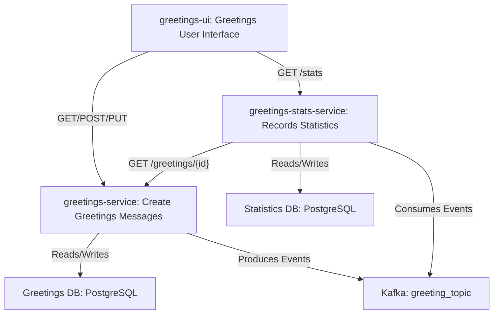

# Demonstration Project

## Builds

### Greetings UI

### Greetings Service

### Stat Service

## Architecture overview

## List of patterns / concepts /technics demonstrated

* Hexagonal Architecture
* Multimodules Spring Boot Project
* REST API with Spring MVC ([greeting service](./greetings-service)) and Spring Web
  Reactive ([stat service](./greetings-stat-service))
* Kafka Consumer ([stat service](./greetings-stat-service)) / producer ([greeting service](./greetings-service))
* Reactive implementation ([stat service](./greetings-stat-service))
* Test : Unit tests with Mockito and AssertJ
* Test : Integration tests with Spring Slice Tests Annotations
* Test : Integration tests with `@EmbeddedKafka`
* Test : Integration tests with [Wiremock](https://wiremock.org/) and Spring Cloud Contract Stub Runner
* Test : CDC tests with [Pact](https://docs.pact5.io)
* Test : BDD tests with Cucumber and JUnit 5

## TODOs

* [ ] Implement Error Handling in API to customize responses
* [ ] Implement [Outbox pattern](https://microservices.io/patterns/data/transactional-outbox.html) for greeting-producer
* [ ] Create a UI to interact with APIs
    * [ ] Create an SSE endpoint to send events to UI