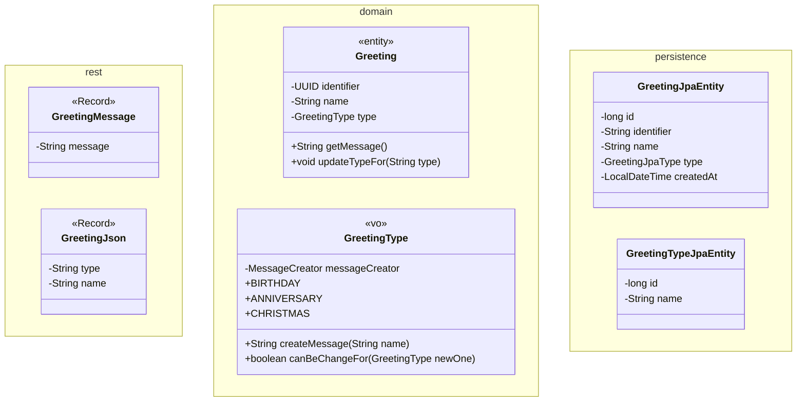

```mermaid
classDiagram
    namespace rest {
        class GreetingMessage {
            <<Record>>
            -String message
        }
        class GreetingJson {
            <<Record>>
            -String type
            -String name
        }
    }

    namespace domain {
        class Greeting {
            <<entity>>
            -UUID identifier
            -String name
            -GreetingType type
            +String getMessage()
            +void updateTypeFor(String type)
        }
        class GreetingType {
            <<vo>>
            -MessageCreator messageCreator
            +BIRTHDAY
            +ANNIVERSARY
            +CHRISTMAS
            +String createMessage(String name)
            +boolean canBeChangeFor(GreetingType newOne)
        }
    }

    namespace persistence {
        class GreetingJpaEntity {
            -long id
            -String identifier
            -String name
            -GreetingJpaType type
            -LocalDateTime createdAt
        }
        class GreetingTypeJpaEntity {
            -long id
            -String name
        }
    }

```
